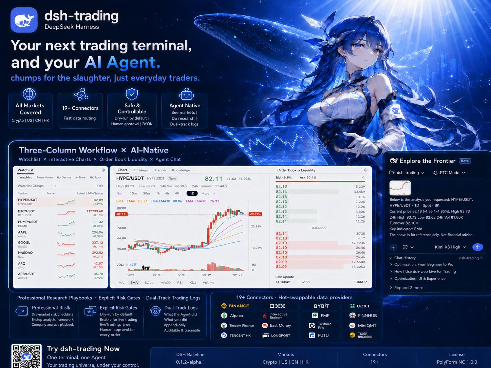
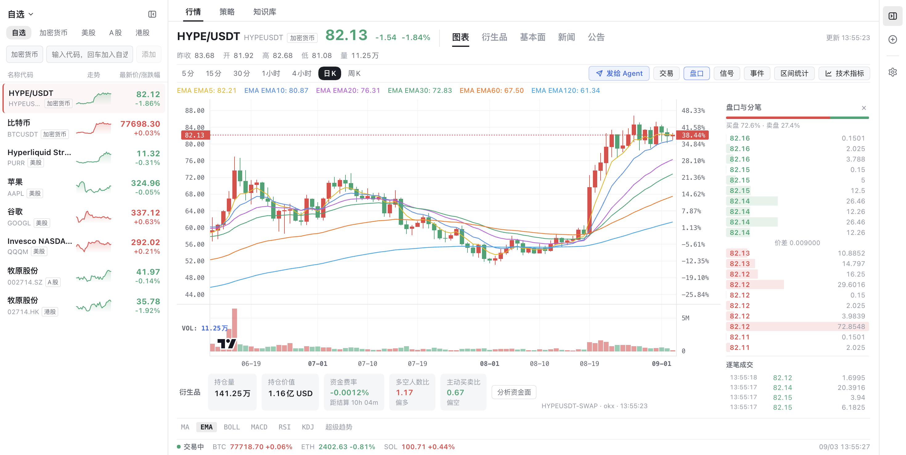
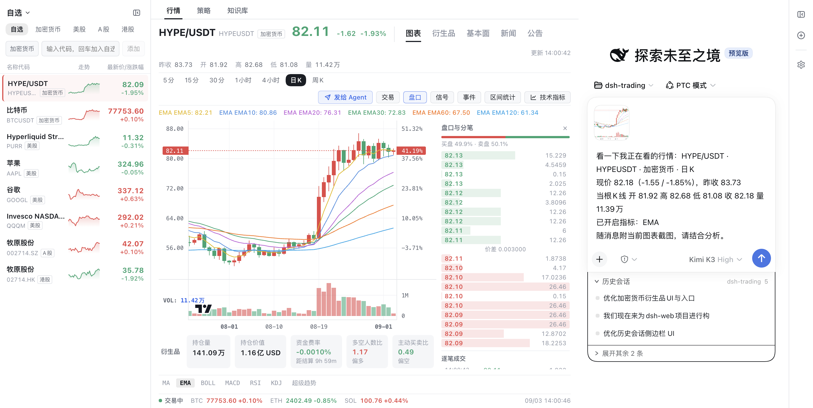
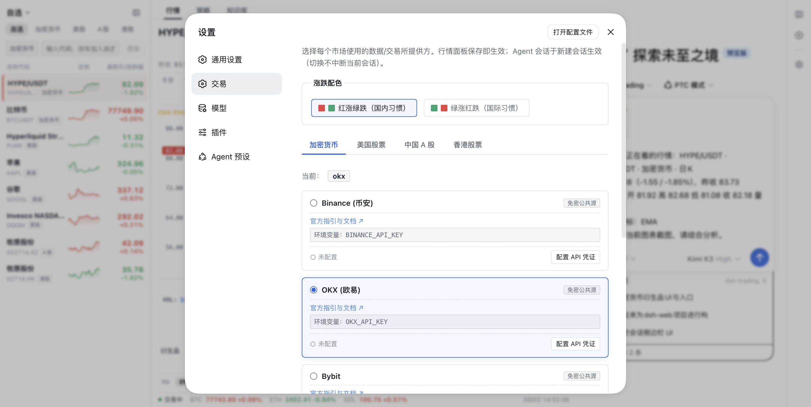

# dsh-trading



> **Your next trading terminal can also be your AI agent.**
> *No chumps for the slaughter, just everyday traders.*

<div align="center">

[](https://github.com/deepseek-ai)
[](#one-terminal-every-market)
[](docs/connectors-guide.md)
[](LICENSE)

</div>

**dsh-trading** is an agent-native trading terminal built on [DeepSeek Harness (DSH)](https://github.com/deepseek-ai). It pairs the three-column workflow of professional trading software — watchlist, interactive chart, order book — with an AI agent that sees what you see, works from institutional-grade playbooks, and can route real orders through explicit, human-gated controls.

Crypto, US equities, China A-shares, and Hong Kong stocks. One terminal. One agent. Nineteen connectors. Zero vendor lock-in: every key stays on your machine.



---

## Why agent-native?

Most "AI trading" tools bolt a chat box onto a chart. dsh-trading inverts the relationship: **the agent is a first-class citizen of the terminal**, and the terminal is the agent's body.

- **The agent sees your screen.** One click on *Send to Agent* packages the symbol you're watching — live quote, current candle, active indicators, and a screenshot of the chart itself — straight into the conversation. No copy-pasting numbers into a chatbot.



- **The agent has hands — gated ones.** Market data, order books, derivatives positioning, news, and order placement are native tools. Orders default to **dry-run simulation**; live routing requires an explicit `liveTrading: true` opt-in *and* an interactive approval for every order. In headless environments it fails closed. Nothing executes behind your back.

- **The agent went to school.** Domain knowledge ships as bundled skills, not vibes: pre-trade risk checklists for every market ([crypto](.agents/skills/crypto-risk-checklist/SKILL.md) · [US](.agents/skills/us-risk-checklist/SKILL.md) · [CN](.agents/skills/cn-risk-checklist/SKILL.md) · [HK](.agents/skills/hk-risk-checklist/SKILL.md)), a five-step [crypto instrument analysis framework](.agents/skills/crypto-instrument-analysis/SKILL.md), a full [company analysis playbook](.agents/skills/company-analysis/SKILL.md), and a [trading journal discipline](.agents/skills/trading-notes-setup/SKILL.md) that dual-tracks what the agent did versus what you did, append-only and auditable.

- **One process, four trading desks.** Session-level presets (`crypto-trader`, `us-trader`, `cn-trader`, `hk-trader`) give each market its own tools, persona, and memory — isolated per session, coexisting in a single DSH process.

## A terminal that trades like software, not a toy

- **Center-stage charting.** Lightweight Charts v5 with multi-timeframe switching (5m to weekly), MA / EMA / BOLL / MACD / RSI / KDJ / SuperTrend with visual parameter editing, strategy signal markers, knowledge-event pins, and drag-to-measure range statistics.
- **Real market depth.** Live order book with buy/sell pressure bars, tick-by-tick trades, and a derivatives cockpit covering open interest, funding rates with settlement countdown, long/short ratios, and taker flow, with one-click *fund-flow analysis* handed to the agent.
- **Cross-market watchlist.** Crypto perps next to AAPL next to 牧原股份, with sparklines and real-time quotes. Your whole risk universe in one dock.

## One terminal, every market

| Market | Connectors |
|---|---|
| **Crypto** | Binance, OKX (Paper/Live), Bybit, CCXT (100+ exchanges) |
| **US Equities** | Yahoo Finance, Alpaca (Paper/Live), FMP, Finnhub, Polygon.io, Interactive Brokers |
| **China A-Shares** | Tencent Finance, Eastmoney, Tushare Pro, AkShare, MiniQMT broker gateway |
| **Hong Kong** | Tencent HK, Longbridge OpenAPI, Futu OpenD, Tiger OpenAPI |

**Hot-swappable data planes.** Settings → Trading routes each market to any installed provider; the quote panel re-routes on save, agent sessions pick it up on the next conversation — no restarts, no config archaeology.



## Safety and privacy, by construction

1. **Dry-run by default.** Every order/cancel tool simulates unless you explicitly flip `liveTrading: true`.
2. **Human gate on every live order.** DSH's approval layer intercepts live routing; headless mode fails closed.
3. **BYOK.** API keys live in your environment variables or local config. Nothing is bundled, relayed, or uploaded.
4. **No data re-distribution.** Market data is fetched for you, under each provider's ToS; nothing is cached for resale or sharing.

## Quick start

```sh
# Install into a dedicated DSH profile (pick your markets)
dsh plugin --profile trading-web add @dshtrading/base @dshtrading/crypto @dshtrading/us
# …or all four markets
dsh plugin --profile trading-web add @dshtrading/base @dshtrading/crypto @dshtrading/us @dshtrading/cn @dshtrading/hk

# Launch the terminal
dsh --profile trading-web
```

Then open the printed URL: watchlist on the left, charts in the middle, your agent on the right. New conversation → pick a market preset → ask it what it sees.

## How it's built

A [Cordis](https://github.com/cordisjs) microkernel ecosystem, layered so markets compose instead of collide:

```
@dshtrading/base          ← core: account/order/quote contracts, approval gate, 3-column GUI shell
├── @dshtrading/crypto    ← Binance / OKX / Bybit / CCXT + skills + preset
├── @dshtrading/us        ← Yahoo / Alpaca / FMP / Finnhub / Polygon / IBKR + skills + preset
├── @dshtrading/cn        ← Tencent / Eastmoney / Tushare / AkShare / MiniQMT + skills + preset
└── @dshtrading/hk        ← Tencent HK / Longbridge / Futu / Tiger + skills + preset
```

Six invariants keep the ecosystem honest: insert-only bundle patches · knowledge lives in skills, not code · dual-track order gates · shared code earns its place in base (≥2 markets) · zero data re-distribution · the GUI shell is replaceable, the data contracts are not.

## Data sources & terms

| Market | Default source | Boundary |
|---|---|---|
| US | Yahoo Finance / Alpaca | Yahoo public endpoint (individual use); Alpaca official Paper/Live APIs |
| CN | Tencent Finance / Eastmoney / HiThink (Fuyao) | Public endpoints; HiThink REST API for fundamentals & auction data; live execution via local MiniQMT gateway |
| HK | Tencent HK / Longbridge | Public endpoint; licensed broker OpenAPI/Gateway for execution |
| Crypto | Binance / OKX | Official APIs; OKX paper trading with your own keys |
| Crypto fundamentals | CoinCap | Public REST, individual use only — no redistribution, no bulk scraping |

## Documentation

- 📖 [Connectors onboarding & configuration](docs/connectors-guide.md)
- 📖 [New connector playbook](docs/connector-playbook.md)
- 📖 [Skills architecture](docs/skills-guide.md)
- 📖 [Symbol vocabulary](docs/symbol-vocabulary.md)
- 📖 [Exchange routing & data plane](docs/exchange-routing.md)
- 🗺️ [Analysis & quant roadmap](docs/analysis-roadmap.md)
- 📜 [Architecture decision log](spikes/REVIEW-LOG.md)
- 🇨🇳 [中文介绍](README_zh.md)

## Friendly Links

- [dsh-web](https://github.com/zhu1090093659/dsh-web)
- [LINUX DO](https://linux.do)

## Community

💬 **QQ group: DSH Trading 交流群（群号 `319737695`）** — questions, feedback, and everything dsh-trading. Scan with QQ to join:

<div align="center">


</div>

## License

[PolyForm Noncommercial 1.0.0](LICENSE) — free for personal study, research, and noncommercial use. **Commercial use requires prior written authorization**: open a GitHub issue or contact <chunlinzhu666@gmail.com>.

> 本项目采用 [PolyForm Noncommercial 1.0.0](LICENSE) 许可：非商业用途免费；商业用途须事先取得书面授权（[chunlinzhu666@gmail.com](mailto:chunlinzhu666@gmail.com) 或 GitHub Issue）。
