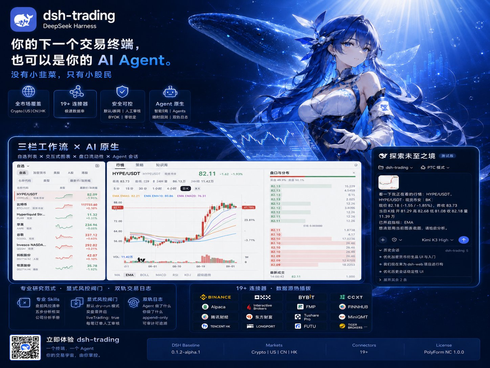
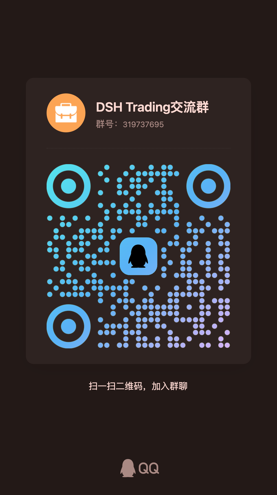

# dsh-trading



> **你的下一个交易终端，也可以是你的 AI Agent。**
> *没有小韭菜，只有小股民*

<div align="center">

[](https://github.com/deepseek-ai)
[](#一个终端全市场覆盖)
[](docs/connectors-guide.md)
[](LICENSE)

</div>

**dsh-trading** 是构建在 [DeepSeek Harness (DSH)](https://github.com/deepseek-ai) 之上的 **Agent 原生交易终端**。它把专业交易软件的三栏工作流——自选列表、交互式图表、盘口——与一个深度集成的 AI Agent 融为一体：Agent 看得到你正在看的行情，按机构级的分析范式做研究，要下真实订单时，每一笔都得过显式的人工审批闸门。

加密货币、美股、A 股、港股。一个终端，一个 Agent，19+ 连接器，零供应商锁定——所有密钥都留在你自己的机器上。


---

## 什么是 Agent 原生？

大多数"AI 交易工具"只是在图表旁边粘了一个聊天框。dsh-trading 把这个关系颠倒过来：**Agent 是终端的一等公民，终端是 Agent 的身体。**

- **Agent 看得到你的屏幕。** 点一下「发给 Agent」，你正在看的标的——实时报价、当前 K 线、已开启的指标、图表截图本身——全部自动打包进会话输入框。不再需要把数字复制粘贴给聊天机器人。


- **Agent 有手，但手上有闸门。** 行情、盘口、衍生品持仓、新闻、下单都是原生工具。所有下单默认 **dry-run 模拟**；实盘路由需要显式打开 `liveTrading: true`，并且每一笔订单都要经过交互式人工审批。无头环境下自动 fail-closed。没有任何订单会背着你执行。

- **Agent 受过专业训练。** 领域知识以 Skill 形式随包分发，而不是靠模型即兴发挥：每个市场的盘前风控清单（[加密](.agents/skills/crypto-risk-checklist/SKILL.md) · [美股](.agents/skills/us-risk-checklist/SKILL.md) · [A股](.agents/skills/cn-risk-checklist/SKILL.md) · [港股](.agents/skills/hk-risk-checklist/SKILL.md)）、五步法[加密标的分析框架](.agents/skills/crypto-instrument-analysis/SKILL.md)、完整[公司分析手册](.agents/skills/company-analysis/SKILL.md)，以及[交易日志纪律](.agents/skills/trading-notes-setup/SKILL.md)——双轨记录「Agent 做了什么」与「你做了什么」，append-only、可审计。

- **一个进程，四个交易台。** 会话级预设（`crypto-trader`、`us-trader`、`cn-trader`、`hk-trader`）让每个市场拥有独立的工具集、人格与记忆——会话之间互相隔离，却共存于同一个 DSH 进程。

## 像软件一样交易的终端，不是玩具

- **C 位图表引擎。** Lightweight Charts v5，5 分钟到周线多周期切换；MA / EMA / BOLL / MACD / RSI / KDJ / 超级趋势全指标可视化管理；策略信号标记、知识事件图钉、框选区间统计。
- **真实市场深度。** 实时盘口与买卖压力条、逐笔成交，以及衍生品驾驶舱——持仓量、资金费率与结算倒计时、多空人数比、主动买卖比——一键把资金面快照交给 Agent 分析。
- **跨市场自选。** 加密合约旁边就是苹果和牧原股份，迷你走势 + 实时报价。你的整个风险宇宙，一个 Dock 装下。

## 一个终端，全市场覆盖

| 市场 | 连接器 |
|---|---|
| **加密货币** | Binance、OKX（模拟/实盘）、Bybit、CCXT（聚合 100+ 交易所） |
| **美股** | Yahoo Finance、Alpaca（模拟/实盘）、FMP、Finnhub、Polygon.io、盈透 IBKR |
| **A 股** | 腾讯财经、东方财富、Tushare Pro、AkShare、MiniQMT 券商网关 |
| **港股** | 腾讯港股、长桥 Longbridge、富途 OpenD、老虎 OpenAPI |

**数据平面热插拔。** 「设置 → 交易」可以把任意市场路由到任意已安装的提供方：行情面板保存即生效，Agent 会话下轮对话自动跟上——不重启、不翻配置文件。


## 安全与隐私，源于架构

1. **默认 dry-run。** 所有下单/撤单工具默认只做模拟，除非你显式打开 `liveTrading: true`。
2. **每笔实盘订单都有人审。** DSH 审批层拦截实盘路由；无头环境 fail-closed。
3. **BYOK。** API 密钥只存在于你的环境变量或本地配置，不打包、不转发、不上传。
4. **数据零再分发。** 行情数据按各提供方 ToS 为你个人拉取，不缓存转售、不对外共享。

## 快速开始

```sh
# 安装到独立 DSH profile（按需选择市场）
dsh plugin --profile trading-web add @dshtrading/base @dshtrading/crypto @dshtrading/us
# …或全市场一次装齐
dsh plugin --profile trading-web add @dshtrading/base @dshtrading/crypto @dshtrading/us @dshtrading/cn @dshtrading/hk

# 启动终端
dsh --profile trading-web
```

打开终端打印的 URL：左边自选，中间图表，右边是你的 Agent。新建会话 → 选择市场预设 → 问它看到了什么。

## 架构一瞥

基于 [Cordis](https://github.com/cordisjs) 微内核的分层生态，让市场之间可组合而不互相踩踏：

```
@dshtrading/base          ← 核心：账户/订单/报价契约、审批闸门、三栏 GUI 外壳
├── @dshtrading/crypto    ← Binance / OKX / Bybit / CCXT + Skills + 预设
├── @dshtrading/us        ← Yahoo / Alpaca / FMP / Finnhub / Polygon / IBKR + Skills + 预设
├── @dshtrading/cn        ← 腾讯 / 东财 / Tushare / AkShare / MiniQMT + Skills + 预设
└── @dshtrading/hk        ← 腾讯港股 / 长桥 / 富途 / 老虎 + Skills + 预设
```

六条设计铁律守护生态：bundle 补丁只允许 insert-only · 知识进 Skill 而非硬编码 · 下单双轨闸门 · 共享代码须 ≥2 个市场需要才能上 base · 数据零再分发 · GUI 外壳可替换、数据契约不可破坏。

## 数据源与条款

| 市场 | 默认数据源 | 边界 |
|---|---|---|
| 美股 | Yahoo Finance / Alpaca | Yahoo 公共端点（个人使用边界）；Alpaca 官方模拟/实盘 API |
| A 股 | 腾讯财经 / 东方财富 / HiThink (同花顺/问财平台) | 公共端点；HiThink REST API 获取估值基本面与竞价；实盘经本地 MiniQMT 券商网关 |
| 港股 | 腾讯港股 / 长桥 | 公共端点；持牌券商 OpenAPI/网关执行 |
| 加密 | Binance / OKX | 官方 API；OKX 支持自带密钥的模拟盘 |
| 加密基本面 | CoinCap | 公共 REST，仅个人使用——不再分发、不批量抓取 |

## 文档

- 📖 [连接器接入与配置指南](docs/connectors-guide.md)
- 📖 [新连接器标准手册](docs/connector-playbook.md)
- 📖 [Skills 架构指南](docs/skills-guide.md)
- 📖 [标的符号规范](docs/symbol-vocabulary.md)
- 📖 [交易所路由与数据平面](docs/exchange-routing.md)
- 🗺️ [定性分析与量化路线图](docs/analysis-roadmap.md)
- 📜 [架构决策与 Spike 裁决史](spikes/REVIEW-LOG.md)
- 🇺🇸 [English README](README.md)

## 友情链接

- [dsh-web](https://github.com/zhu1090093659/dsh-web)
- [LINUX DO](https://linux.do)

## 社区

💬 **QQ 交流群：DSH Trading 交流群（群号 `319737695`）**——使用交流、问题反馈、功能建议，QQ 扫码即可加入：

<div align="center">



</div>

## 许可证

本项目采用 [PolyForm Noncommercial 1.0.0](LICENSE) 许可：个人学习、研究、兴趣项目等非商业用途免费使用；**任何商业用途须事先取得项目所有者的书面授权**，请通过 [chunlinzhu666@gmail.com](mailto:chunlinzhu666@gmail.com) 或 GitHub Issue 洽谈商用许可。