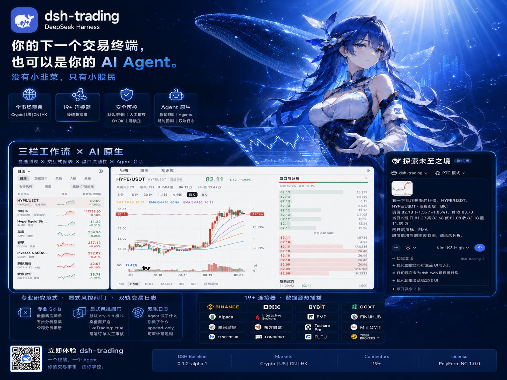
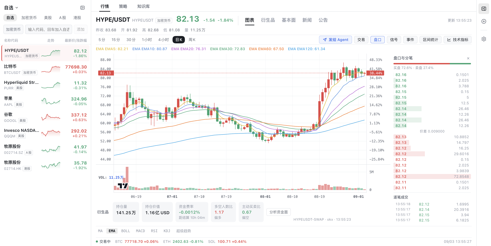
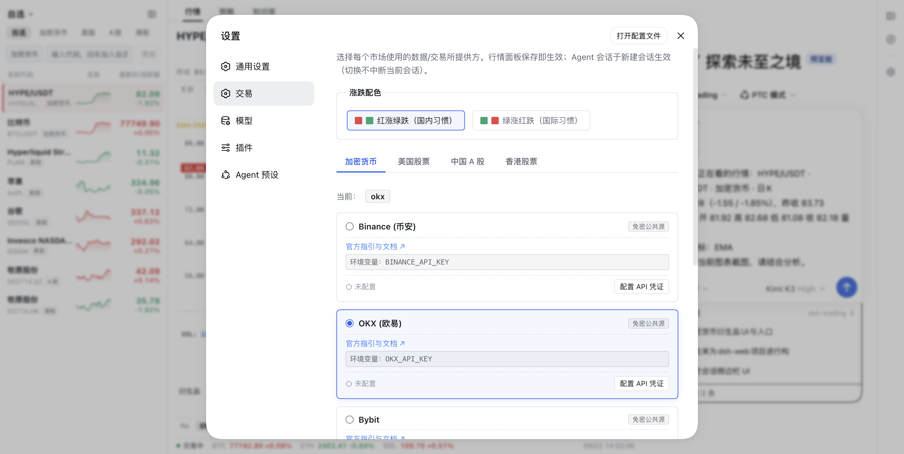
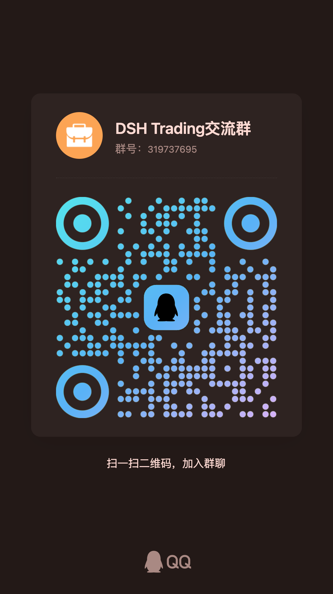

# dsh-trading — 全市场开源 AI 交易终端与多智能体量化投研平台

> **当前状态与交接**：见 [docs/current-state.md](docs/current-state.md)（已验收项、必须知道的 fail-closed 不变量、未完成与硬停、验证命令、文档地图）。

[English](README.md) | **简体中文**

**dsh-trading** 是基于 [DeepSeek Harness (DSH)](https://github.com/deepseek-ai) 和 [Cordis](https://github.com/cordisjs) 微内核架构构建的开源、Agent 原生全市场 AI 交易终端与量化投研系统。在一个模块化工作区内全面覆盖**加密货币**（Binance、OKX、Bybit、CCXT）、**美股**（Alpaca、盈透证券 IBKR、Yahoo Finance）、**A 股**（MiniQMT、东方财富、腾讯财经、HiThink、AkShare、Tushare）、**港股**（长桥、富途、老虎）以及**国内商品期货**。

系统深度整合 TradingView Lightweight Charts v5 图表引擎、多角色协作的 AI 投研团队（大师、标的分析研究员、交易员、风险审查员）、内置量化策略回测引擎与零信任双轨人工审批闸门，让深层次 AI 推理真正服务于有纪律的交易执行。

[快速开始](#快速开始) · [核心功能](#核心功能) · [方案对比](#为什么选择-dsh-trading) · [支持市场与连接器](#一个终端全市场覆盖) · [Agent 原生架构](#什么是-agent-原生) · [常见问题](#常见问题) · [文档导航](#文档)



> **你的下一个交易终端，也可以是你的 AI Agent。**
> *没有小韭菜，只有小股民。*

<div align="center">

[](https://github.com/deepseek-ai)
[](#一个终端全市场覆盖)
[](docs/guides/connectors-guide.md)
[](https://github.com/cordisjs)
[](https://tradingview.github.io/lightweight-charts/)
[](#安全与隐私纪律是焊死的高于一切)
[](LICENSE)

</div>

---

## 核心功能

- **全市场跨品种自选与统一数据平面：** 同一自选列表与联动工作区内同时跟踪加密合约/现货、美股、A 股、港股和国内商品期货，聚合 Level 1/Level 2 实时行情、多周期 K 线、盘口深度与公告资讯。
- **C 位 TradingView 图表与衍生品驾驶舱：** 搭载 Lightweight Charts v5，支持 5 分钟到周线多周期无缝切换，提供 MA / EMA / BOLL / MACD / RSI / KDJ / 超级趋势 / TD9 等 15+ 常用技术指标、逐笔成交、多空人数比、持仓量（OI）及资金费率监控。
- **Agent 原生多智能体协同（基于 DeepSeek Harness）：** 角色化 Agent 团队（全能大师 `master`、标的分析研究员 `instrument-researcher`、交易员 `trader`、风控审查员 `risk-reviewer`）自主调度原生行情与财务工具，进行报表穿透、交易计划起草与极限压力测试。
- **机构级投研范式与盘前风控清单：** 随包分发各市场盘前风控检查清单（加密、美股、A 股、港股）、五步法加密标的定性分析框架、全流程公司分析手册与双轨可审计的交易日志。
- **量化策略回测与自定义指标创作：** 原生集成 `strategy_backtest` 回测引擎与经典量化范式（唐奇安突破、RSI 回归、双均线、布林带回归、200日均线趋势），支持自定义指标编写与图表回显。
- **零信任双轨实盘审批闸门：** 下单工具默认 100% dry-run 模拟；实盘必须显式开启 `liveTrading: true` 并经过交互式人工确认与 Ed25519 权限授权，无头环境自动 fail-closed，杜绝未受控下单。
- **100% 本地隐私与凭据安全（BYOK）：** 自带密钥（Bring Your Own Keys）。所有 API 密钥、券商凭证与交易数据仅保存在个人本地机器，不上传云端、无厂商锁定、不转售或缓存行情数据。

---

先问各位一个问题：

你亏过的钱里，有多少是「没想清楚」亏的？

追高，站岗。抄底，抄在半山腰。止损，刚割就反弹；不止损，一扛扛到深套。（这些场面，老手也未必躲得开。）

问题出在哪？不在手气，在纪律。

行情天天开，多空两军天天交战。散户手里最趁手的武器从来不是消息，是纪律。老猎手九成时间在等，一成时间出手；多数人做交易正好反过来——九成时间在动手，一成时间在后悔。

所以有了 dsh-trading：一个构建在 [DeepSeek Harness (DSH)](https://github.com/deepseek-ai) 之上的 **Agent 原生交易终端**。专业交易工作流，配上一个与市场同频的 AI Agent：行情、资讯、资金流转，它全部掌握；研究按机构级范式来；要下真实订单，每一笔都得过你亲手点的审批闸门。

加密货币、美股、A股、港股。一个终端，一个 Agent，19+ 连接器，零供应商锁定——所有密钥都留在你自己的机器上。



---

## 为什么选择 dsh-trading？

| 核心维度 | 传统交易终端（TradingView / 券商软件） | 泛用 AI 对话框（ChatGPT / Copilot 侧边栏） | **dsh-trading（Agent 原生交易终端）** |
|---|---|---|---|
| **全市场覆盖** | 各市场账户分散割裂，需多软件切换 | 纯文本聊天，无实时行情与标的联动 | **单个自选与 Dock 整合加密、美股、A股、港股与商品期货** |
| **实时深度与衍生品** | 昂贵的逐项订阅或高壁垒数据孤岛 | 无法获取真实盘口，甚至产生价格幻觉 | **实时 L2 盘口、逐笔成交、加密持仓量（OI）、资金费率与多空比** |
| **AI 深度整合** | 无 AI 或仅外挂简单静态预警 | 贴在图表旁边的对话框，需手动截图粘贴 | **终端即 Agent 的身体：Agent 自主调用数据工具与代码运行分析** |
| **多智能体分工** | 无 | 单一 Prompt、单模型单打独斗 | **角色化团队分工：大师统筹 + 研究员穿透 + 交易员起草 + 风控一票否决** |
| **专业投研范式** | 依赖交易员个人脑力经验，无标准化清单 | 泛泛的网络搜索摘要，缺乏风控逻辑 | **随包分发各市场盘前风控清单、五步法定性分析与双轨交易日志** |
| **策略与回测** | 封闭脚本语言（如 Pine Script）或单机脚本 | 无法基于真实全市场盘口运行代码 | **工作区内置 `strategy_backtest` 引擎，支持指标创作与历史验证** |
| **交易安全与防踏空** | 手动操作或黑盒全自动策略，缺乏双轨控制 | 无法受控下单或直接调用未经验证的接口 | **双轨闸门：默认 dry-run，实盘必须人工审批确认，Ed25519 权限防线** |
| **隐私与密钥安全** | 凭证存储在第三方云端服务器 | 对话上下文与敏感持仓信息上传云端 | **100% BYOK 本地存储，零数据再分发，完全私有化运行** |

---

## 什么是 Agent 原生？

市面上的「AI 交易工具」长什么样？图表旁边粘一个聊天框。

那是贴上去的，不是长出来的。

dsh-trading 把关系颠倒过来：**Agent 是终端的一等公民，终端是 Agent 的身体。**四件事，说清它和你用过的聊天机器人差在哪：

1、**行情、资讯、资金流转，Agent 全部掌握。** 实时报价、当前 K 线读数、图表序列的时间范围与取数位置、已开指标的当根读数、资金面快照、公告、新闻和基本面摘要，都是它的原生工具面——Agent 按你盯着的标的自己调工具取同源数据、写代码分析。取不到的来源明确标注，并引导它用项目工具补查、核验原始披露。不用再截图、复制、粘贴三件套。

2、**Agent 能下单，但闸门在你手里。** 行情、盘口、衍生品持仓、新闻、下单，都是它的原生工具。可下单默认 **dry-run 模拟**；想实盘，先显式打开 `liveTrading: true`，然后每一笔订单还得你亲手审批。无头环境直接 fail-closed。

一句话：不动则已，一动，必过闸。没有任何订单会背着你执行。

3、**Agent 受过专业训练。** 知识不靠模型即兴发挥，是随包分发的 Skill：四个市场的盘前风控清单（[加密](.agents/skills/crypto-risk-checklist/SKILL.md) · [美股](.agents/skills/us-risk-checklist/SKILL.md) · [A股](.agents/skills/cn-risk-checklist/SKILL.md) · [港股](.agents/skills/hk-risk-checklist/SKILL.md)）、五步法[加密标的分析框架](.agents/skills/crypto-instrument-analysis/SKILL.md)、完整[公司分析手册](.agents/skills/company-analysis/SKILL.md)，还有[交易日志纪律](.agents/skills/trading-notes-setup/SKILL.md)——双轨记录「Agent 做了什么」和「你做了什么」，append-only，可审计。

开仓前先过风控清单。这份纪律，多少老手做十年都做不到（多半栽在「就这一次」上）。

4、**一位大师，统领角色化团队。** `master`「大师」是全能型多 agent 团队主导者：凡交易问题先读统一资产台账（`holdings_list` / `holdings_stage`）与各市场余额工具，再优先检索用户知识库，然后拆解任务、用带角色 persona 的子代理委派细分工作——标的分析交给研究员（`researcher_subagent`）、交易计划草拟交给交易员（`trader_subagent`）、方案复核交给风控（`risk_reviewer_subagent`），并按任务类型点名项目技能（分析框架、各市场 risk-checklist、trading-strategy-paradigms 配 `strategy_backtest`、一次性跨标的聚合用动态包），交叉核对后整合成单一结论；跨市场速览与交易执行可亲自完成，同样默认 dry-run、实盘过闸，子代理只产分析与建议文本，执行始终由大师过闸完成。下设 `trader`「交易员」（交易计划与过闸执行）、`instrument-researcher`「标的分析研究员」（公告核验、基本面、估值与反方情景）、`risk-reviewer`「风险审查员」（敞口、压力情景与否决条件）。所有角色主动优先调用项目知识库、新闻公告和基本面工具。研究与风控保留只读行情/K线，不挂下单/撤单连接器；子代理继承会话工具面，角色 persona 约束职责边界——公共 host 工具仍可见，角色分工不是独立安全沙箱。

base 安装器按实际启用的市场生成四种角色，支持只安装部分市场；部署默认新会话进入「大师」（用户可在设置里改选默认预设）。未修改的托管旧市场预设移到同级 `.legacy-backup` 备份 root；无管理戳、修改过或含额外文件的目录原样保留，不删除用户预设数据。

---

## 终端本身，先得是个正经软件

终端不像样，Agent 再聪明也是纸上谈兵。

- **C 位图表引擎。** Lightweight Charts v5，5 分钟到周线多周期切换；MA / EMA / BOLL / MACD / RSI / KDJ / 超级趋势全指标可视化管理；策略信号标记、知识事件图钉、框选区间统计。
- **真实市场深度。** 实时盘口与买卖压力条、逐笔成交，衍生品驾驶舱——持仓量、资金费率与结算倒计时、多空人数比、主动买卖比。行情与资金面数据都是 Agent 的原生工具，按需自取。
- **跨市场自选。** 加密合约旁边就是苹果和牧原股份，迷你走势 + 实时报价。你的整个风险宇宙，一个 Dock 装下。

### 运维面开箱即用

- **使用统计。** DSH 内置的「性能与用量」设置展示每轮会话的 token 流与花费；凭据只在宿主进程内解析，不进浏览器。
- **插件管理。** 「插件」设置区新增管理标签页：npm 包名或 git 仓库地址安装、下次启动生效的启用开关、按各包声明的 DSH 最低版本门禁的更新校验与安装、冲突回滚，以及失败后交给 Agent 的修复会话。写入仅限本机 loopback 且经官方 CLI 执行；桌面版自带 `dsh` 垫片，无需全局安装即可用。
- **按模型声明能力。** 每个自定义 `llm-pi-ai` provider 卡片内就地声明每模型的图片输入与推理档位（含每档实际发送的线上值），或把 provider 归档下线路由而不动已存密钥。

---

## 一个终端，全市场覆盖

dsh-trading 已打通 19+ 数据源、交易所及券商连接器：

| 市场 | 连接器与数据提供方 | 数据覆盖与行情能力 | 交易与认证方式 |
|---|---|---|---|
| **加密货币** | **Binance（币安）**、**OKX（欧易）**、**Bybit**、**CCXT（现货聚合，九所直连）** | Binance / OKX / Bybit：现货与永续合约报价、盘口深度、K 线、持仓量、资金费率、多空人数比。CCXT：现货报价与 K 线各有九条直连（binance / okx / bybit / gateio / kucoin / kraken / coinbase / bitfinex / htx），K 线周期按所映射；无盘口、无衍生品、无账户读面，永续 `-SWAP` 入参显式拒绝 | REST 轮询（各连接器均无 WebSocket 通道），本地 BYOK 密钥；OKX 支持张币自动折算（ctVal）与模拟/实盘 |
| **美股** | **Alpaca**、**盈透证券（IBKR）**、**Yahoo Finance**、**FMP**、**Finnhub**、**Polygon.io** | 实时报价、历史行情、财务报表、现金流量表、SEC 原始披露、分析师评级 | 官方经纪商 REST/WS 交易网关，BYOK 凭证；Yahoo Finance 免密钥公共接口 |
| **A 股** | **MiniQMT 券商网关**、**腾讯财经**、**东方财富**、**HiThink（同花顺/富遥）**、**Tushare Pro**、**AkShare** | 实时 L1 行情、集合竞价、日 K 线、板块资金流向、估值基本面指标 | 本地 MiniQMT 客户端实盘交易；公共 REST 接口免密获取基础行情与资讯 |
| **港股** | **长桥 Longbridge OpenAPI**、**富途 OpenD**、**老虎证券 Tiger OpenAPI**、**腾讯港股** | 实时港股行情、Level 2 盘口深度、窝轮牛熊证衍生品数据 | 持牌券商 OpenAPI / 本地网关执行；腾讯港股公共行情 |
| **国内商品期货** | **HiThink（同花顺/富遥期货）** | 日 K 线、分时点位、主力合约切换、商品与股指期货行情数据平面 | 机构级 REST API（纯数据平面，无执行面） |

**数据平面热插拔。** 数据源不合口味？换。「设置 → 交易」里把任意市场路由到任意已装提供方：行情面板保存即生效，Agent 会话下轮对话自动跟上——不重启，不翻配置文件。



---

## 安全与隐私：纪律是焊死的，高于一切

交易的公式，从来都是：**专研 + 等待 + 果断 + 耐心 = 活得久。**

工具替不了你等待，也替不了你耐心。但它能守住中间那道闸：

1. **默认 dry-run 模拟。** 所有下单/撤单工具默认只做仿真模拟，除非你显式打开 `liveTrading: true`。
2. **每笔实盘订单都需人工交互审批。** DSH 审批层拦截实盘路由；无头会话自动 fail-closed。
3. **100% BYOK 本地凭据。** API 密钥只存在于你的环境变量或本地配置，不打包、不转发、不上传任何第三方。
4. **数据零再分发。** 行情数据按各提供方 Terms of Service 为你个人实时拉取，不缓存转售、不对外共享。

没有你的签字，一分钱不会动。

---

## 快速开始

### 1. 安装

trading 走独立 DSH home（`~/.dsh-trading`），与主 dsh web home（`~/.dsh`）互不污染；全部 dsh-trading 包的数据路径都经 `$DSH_HOME` 解析。

```sh
# 安装到独立 DSH profile（按需选择市场）
export DSH_HOME=~/.dsh-trading
dsh plugin --profile trading-web add @dshtrading/base @dshtrading/crypto @dshtrading/us

# 或全市场一次装齐
dsh plugin --profile trading-web add @dshtrading/base @dshtrading/crypto @dshtrading/us @dshtrading/cn @dshtrading/hk

# 给该 profile 接上浏览器 UI（一次即可）：在清单核心层后插入 web 宿主层
node -e "const f=(process.env.DSH_HOME||require('os').homedir()+'/.dsh')+'/profiles/trading-web/package.json',fs=require('fs'),m=JSON.parse(fs.readFileSync(f,'utf8'));m.dsh.profile.bundles.includes('@deepseek-ai/dsh-web-app')||m.dsh.profile.bundles.splice(1,0,'@deepseek-ai/dsh-web-app');fs.writeFileSync(f,JSON.stringify(m,null,2)+'\n')"
```

### 2. 运行

```sh
# 从本仓 checkout 运行：先装一次 wrapper，再启动
cp scripts/home/dsh-trading ~/.local/bin/ && chmod +x ~/.local/bin/dsh-trading
dsh-trading --profile trading-web        # 缺省监听 8888 端口

# 只装了 npm 包、没有仓库？wrapper 负责 DSH_HOME 与 8888 缺省：
DSH_HOME=~/.dsh-trading dsh --profile trading-web --port 8888
```

内置四个 profile，按用途选择：

| Profile | 界面形态 | 包含组件与 Bundle |
|---|---|---|
| `trading-web` | 浏览器 GUI（推荐） | dsh-base + dsh-web-app + base + gui + bot-api + crypto + us + cn + hk + futures + global |
| `trading-dev` | 无头环境，单市场 | dsh-base + dsh-headless + base + crypto |
| `trading-all` | 无头环境，全市场 | dsh-base + dsh-headless + base + all + cn + crypto + hk + us |
| `trading-bot` | 机器人平面：Agent 宿主 + `/dshtrading/api`（仅回环） | dsh-base + base + bot + bot-api + crypto（源码见私有卫星仓 [dsh-trading-bot](https://github.com/zhu1090093659/dsh-trading-bot)） |

打开终端输出的 URL：左边自选，中间图表，右边是你的 Agent。新建会话 → 选择对应市场预设 → 问它：「你看到了什么？」

### 3. 本地构建与开发

```sh
pnpm install && pnpm build && pnpm test   # Node 见 engines（^22.19.0 || >=24.0.0），pnpm 11
./scripts/refresh-profile.sh              # 重建 profile 里的 file: 包副本（缺省 trading-web）
```

完整的运行、profile 与刷新契约见 [docs/ops/running.md](docs/ops/running.md)。

---

## 架构一瞥

基于 [Cordis](https://github.com/cordisjs) 微内核的分层生态，市场之间可组合、不踩踏：

```
@dshtrading/base          ← 核心：账户/订单/报价契约、审批闸门、GUI 外壳
├── @dshtrading/crypto    ← Binance / OKX / Bybit / CCXT + Skills + 预设
├── @dshtrading/us        ← Yahoo / Alpaca / FMP / Finnhub / Polygon / IBKR + Skills + 预设
├── @dshtrading/cn        ← 腾讯 / 东财 / Tushare / AkShare / MiniQMT + Skills + 预设
└── @dshtrading/hk        ← 腾讯港股 / 长桥 / 富途 / 老虎 + Skills + 预设
```

六条铁律给生态上锁：
1. bundle 补丁只允许 **insert-only**。
2. 领域知识进 **可复用 Skill**，而非硬编码提示词。
3. **双轨闸门** 保护每一笔订单。
4. 共享代码须 **≥2 个市场** 需要才能上 base。
5. **数据零再分发**，严格恪守提供方 ToS。
6. GUI 外壳可替换、底层数据契约不可破坏。

### 实盘授权平面（已交付，默认禁用）

- **实盘授权平面**：实盘开关不在 agent 可写路径上。只有人工签署的密码学授权（Ed25519）能打开实盘路由，agent 侧永远读不到签署材料。它在本仓（`packages/authority`），与公开 GUI 的行情桥（`packages/bot-api`）同源。
- **自动交易卫星仓边界**：自动交易平面本身（后台守护进程、带额度与风控闸门的交易核心、网页驾驶舱、iOS 观测端与部署单元）不在本公开仓，位于私有卫星仓 [dsh-trading-bot](https://github.com/zhu1090093659/dsh-trading-bot)，主仓保留独立构建所需的接口缝隙。

---

## 数据源与条款

| 市场 | 默认数据源 | 边界与合规要求 |
|---|---|---|
| **美股** | Yahoo Finance / Alpaca | Yahoo 公共端点（个人使用边界）；Alpaca 官方模拟/实盘 API |
| **A 股** | 腾讯财经 / 东方财富 / HiThink (同花顺/富遥) | 公共端点；HiThink REST API 获取估值基本面与竞价；实盘经本地 MiniQMT 券商网关 |
| **期货 (国内)** | HiThink (同花顺/富遥期货) | HiThink REST API 获取日 K / 分时点位 / 主力合约；纯数据平面，无执行面 |
| **港股** | 腾讯港股 / 长桥 | 公共端点；持牌券商 OpenAPI/网关执行 |
| **加密货币** | Binance / OKX | 官方 API；OKX 支持自带密钥的模拟盘 |
| **加密基本面** | CoinCap | 公共 REST，仅个人使用——不再分发、不批量抓取 |

---

## 常见问题

### dsh-trading 是自动量化交易机器人吗？

它是 **AI 辅助交易终端**，不是无人值守的黑盒实盘机器人。下单工具默认 dry-run 仿真模拟；实盘必须显式开启 `liveTrading: true` 并经过人工交互审批，无头环境自动拒绝执行。dry-run 模拟与交易所、券商提供的模拟盘（Paper Trading）不是同一概念。

### 支持哪些大模型（LLM）？

dsh-trading 依托 DeepSeek Harness (DSH)，原生支持 **DeepSeek (V3 / R1)**、Anthropic Claude、OpenAI GPT-4o，以及任意兼容 OpenAI 规范的本地/私有模型（如 Ollama、vLLM）。你可以在设置中为不同模型配置图片输入支持、推理档位与 Token 消耗限额。

### 支持哪些交易所、券商和行情 API？

加密货币包括 Binance（币安）、OKX（欧易）、Bybit 与 CCXT（现货聚合，九所直连：binance / okx / bybit / gateio / kucoin / kraken / coinbase / bitfinex / htx，ticker 与 K 线同集）；美股包括 Alpaca、盈透证券（Interactive Brokers）、Yahoo Finance、FMP、Finnhub、Polygon；A 股包括 MiniQMT 券商网关、东方财富、腾讯财经、HiThink、Tushare Pro、AkShare；港股包括长桥 Longbridge、富途 OpenD、老虎证券 Tiger；国内商品期货包括同花顺/富遥期货。详见[连接器接入与配置指南](docs/guides/connectors-guide.md)。

### 使用前必须配置 API Key 吗？

部分公开行情源（如腾讯财经、东方财富、Yahoo Finance 等）无需密钥即可直接使用。若需获取高精度实时流、接入券商/交易所账户或调用云端 AI 模型，需要配置相应凭证。项目严格遵循 **BYOK** 原则，所有密钥保留在本地。

### 支持策略回测与自定义指标吗？

支持。终端提供 `strategy_backtest` 回测引擎，内置了唐奇安突破、RSI 极值回归、EMA 双均线、布林带回归等多类经典策略范式，同时支持用户通过技术指标创作能力（indicator-authoring）自定义 SuperTrend、TD9 等指标并绘制于图表上。

### dsh-trading 可以免费商用吗？

不可以。项目采用 [PolyForm Noncommercial 1.0.0](LICENSE) 许可，非商业用途免费；商业用途须事先取得书面授权。本软件不构成投资建议，也不保证交易收益。

---

## 文档

- [文档体系索引与全景导航](docs/README.md)
- [运行、profile 与本地开发](docs/ops/running.md)
- [连接器接入与配置指南](docs/guides/connectors-guide.md)
- [新连接器标准手册](docs/guides/connector-playbook.md)
- [Skills 架构指南](docs/guides/skills-guide.md)
- [标的符号规范](docs/guides/symbol-vocabulary.md)
- [交易所路由与数据平面](docs/guides/exchange-routing.md)
- [定性分析与量化路线图](docs/roadmap/analysis-roadmap.md)
- [架构决策与 Spike 裁决史](spikes/REVIEW-LOG.md)
- [English README](README.md)

## 友情链接

- [dsh-web](https://github.com/zhu1090093659/dsh-web)
- [LINUX DO](https://linux.do)

## 社区

**QQ 交流群：DSH Trading 交流群（群号 `319737695`）**——使用交流、问题反馈、功能建议，QQ 扫码即可加入：

<div align="center">



</div>

---

## 写在最后

工具是死的，纪律是活的。终端再好，也替不了你按下买入键那一刻的判断；但它能保证，你每一次动手，都是想清楚之后的动作。

去经历，去犯错，去复盘。路还长，与各位共勉。

**本项目只是一个软件，不构成任何投资建议。行情有风险，下单需谨慎。**

## 许可证

本项目采用 [PolyForm Noncommercial 1.0.0](LICENSE) 许可：个人学习、研究、兴趣项目等非商业用途免费使用；**任何商业用途须事先取得项目所有者的书面授权**，请通过 [chunlinzhu666@gmail.com](mailto:chunlinzhu666@gmail.com) 或 GitHub Issue 洽谈商用许可。

---

### 搜索关键词与标签索引

`AI量化交易` · `DeepSeek炒股` · `AI交易终端` · `DeepSeek量化` · `多智能体量化` · `TradingView开源终端` · `Lightweight Charts` · `A股量化接口` · `MiniQMT量化` · `美股量化交易` · `Alpaca交易` · `盈透证券量化` · `港股量化` · `富途量化` · `长桥量化` · `加密货币量化` · `Binance量化` · `OKX量化` · `CCXT量化` · `策略回测` · `技术分析指标` · `风控闸门`
